## 2018_HR_Management

### FUNCTIONALITY (actualization 8.02.2018)
Human Resources Management web application mainly for training budget management.
It is designed for HR employees.

Functionality:
	
	- add / modify employees
	- add / modify / delete unit
	- add / modify / delete training
	- show all employees / units / trainings
	- training registration
	- budget split
	- (in the future: adding the cost of trainings and calculate units expenses)
	- (in the future: generating reports about budget per unit also to Excel - using ApachePOI).

[Java, SQL, Hibernate, JSP, Spring, Spring Data, MVC, (Maven Project)]

### DATABASE (actualization 8.02.2018)

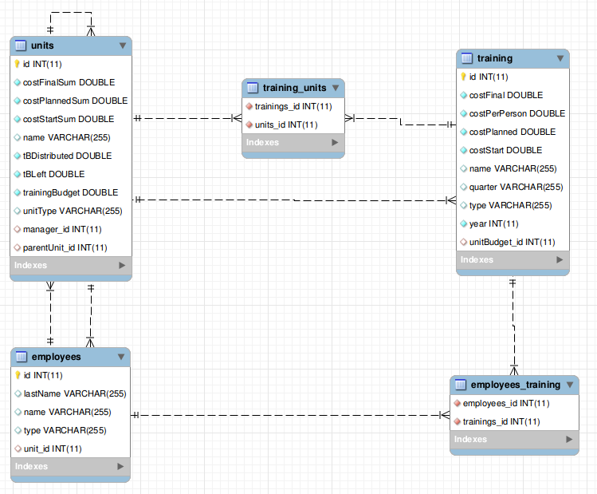

### PRINTSCREENS (actualization 8.02.2018)

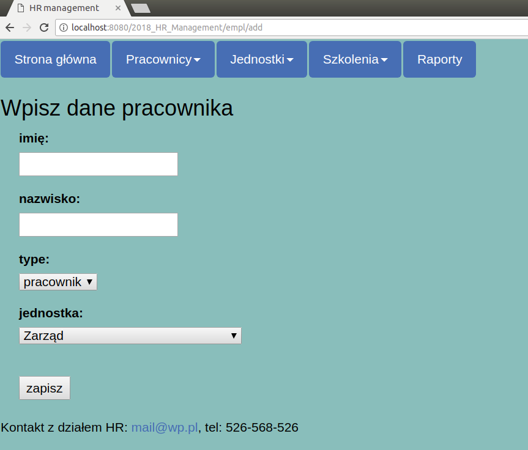
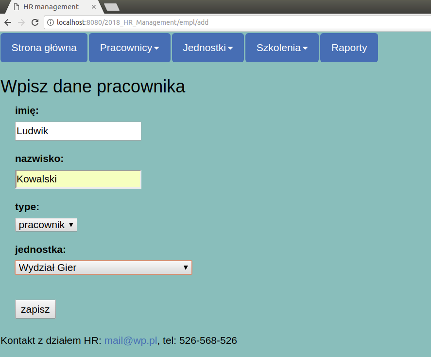
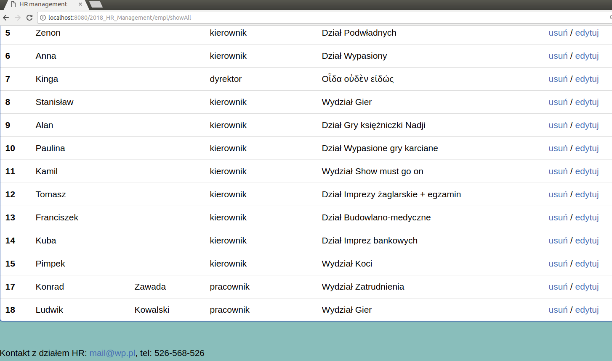
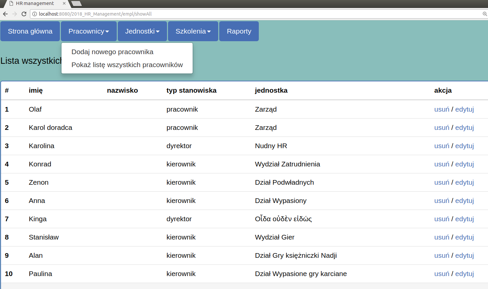

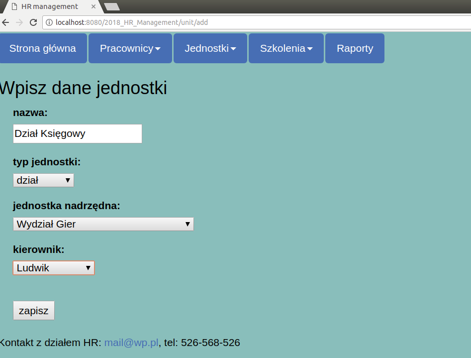
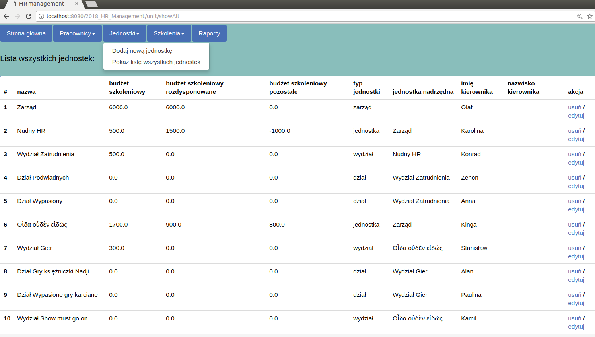
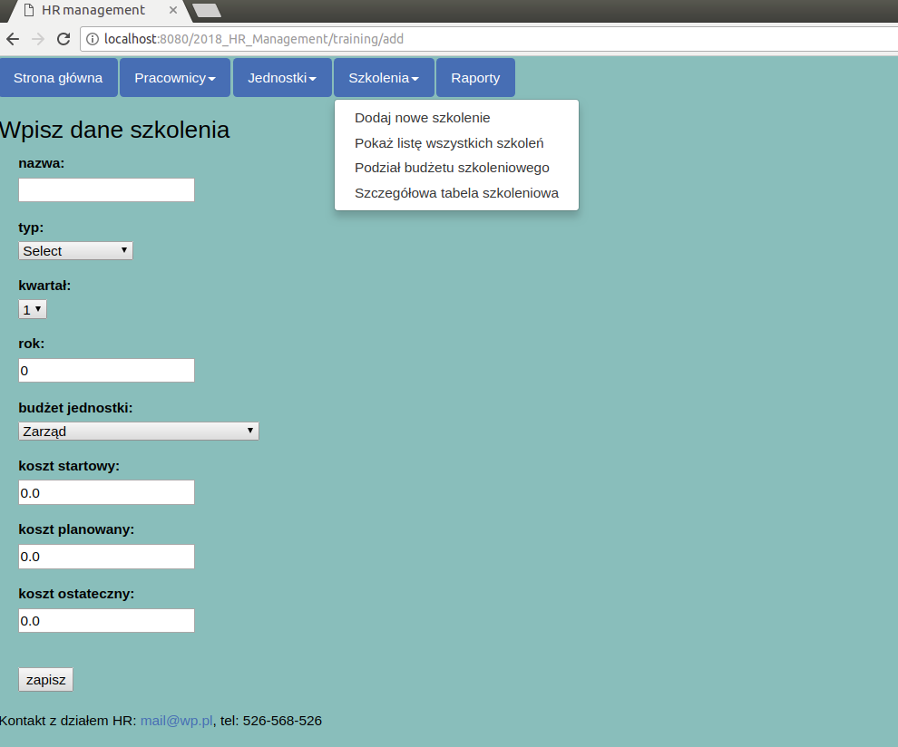
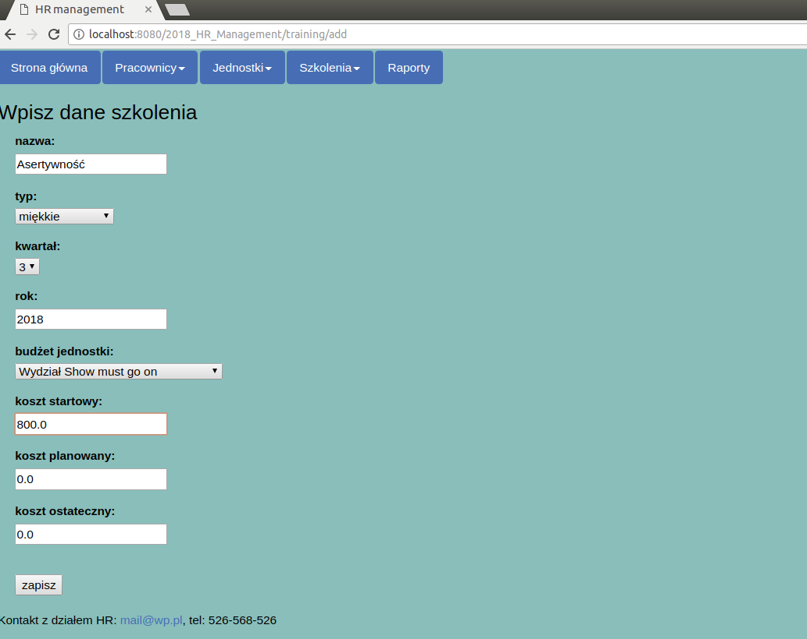
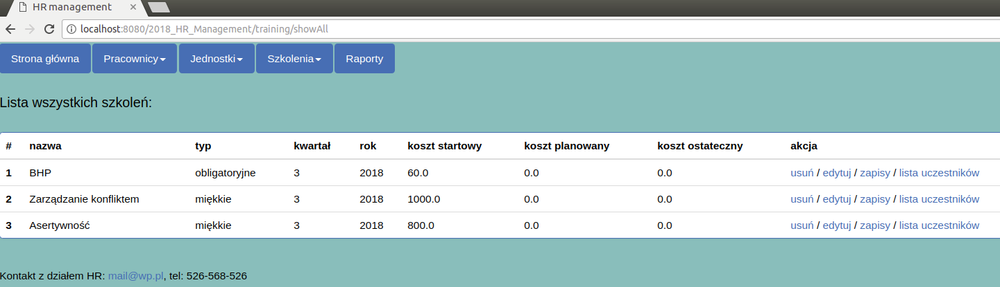
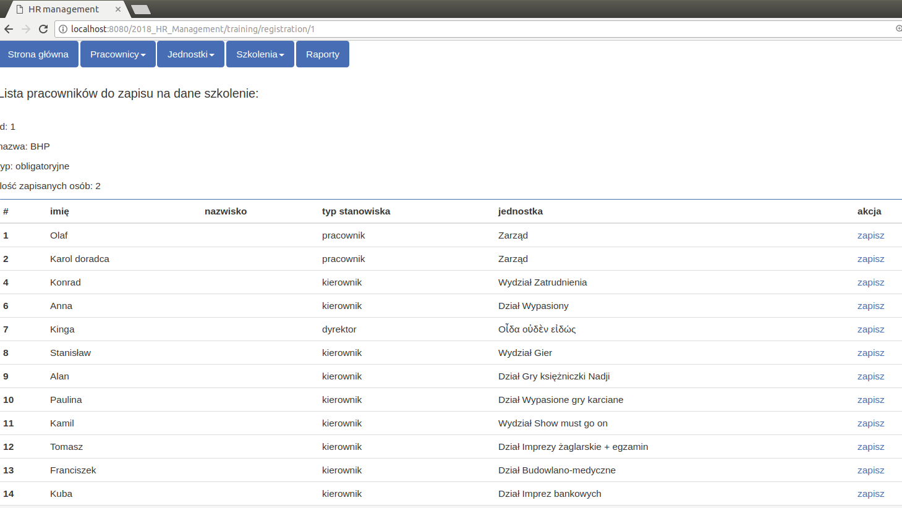
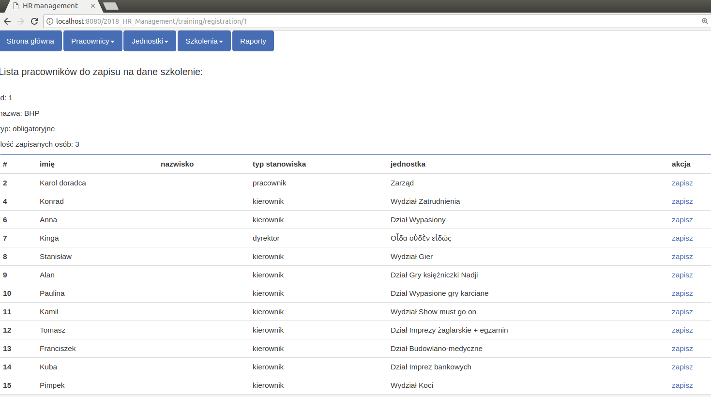
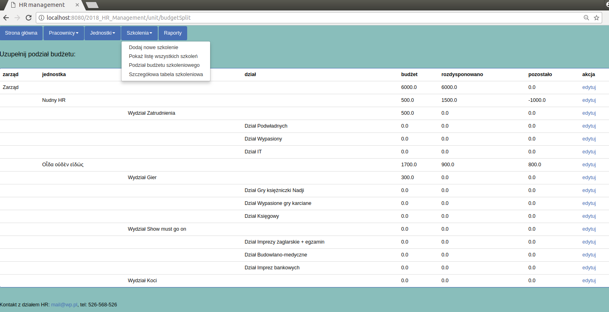
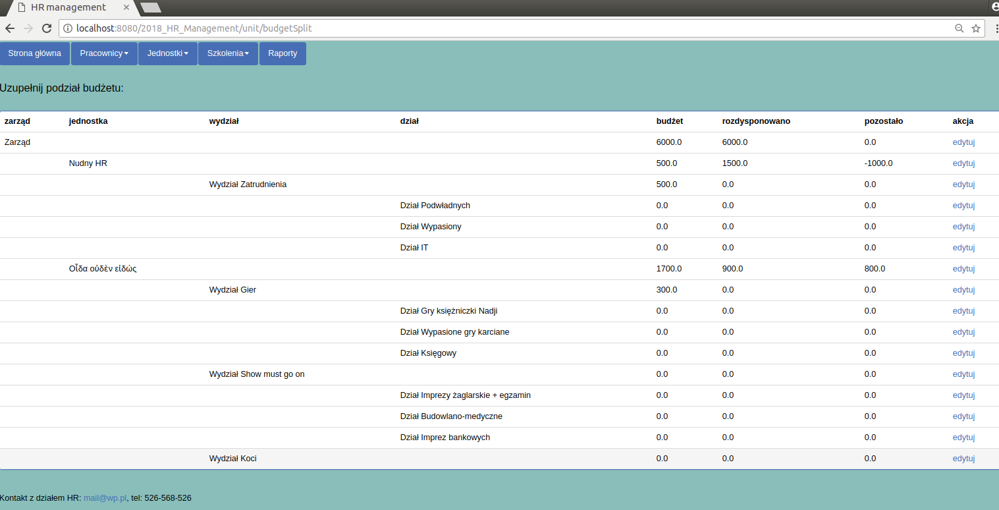
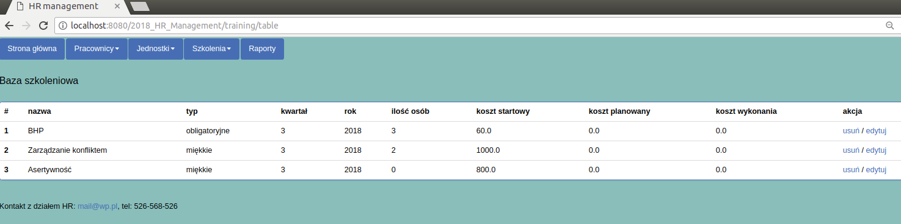
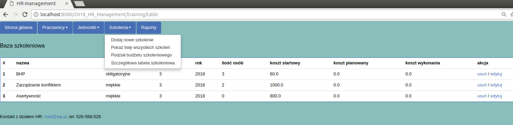

